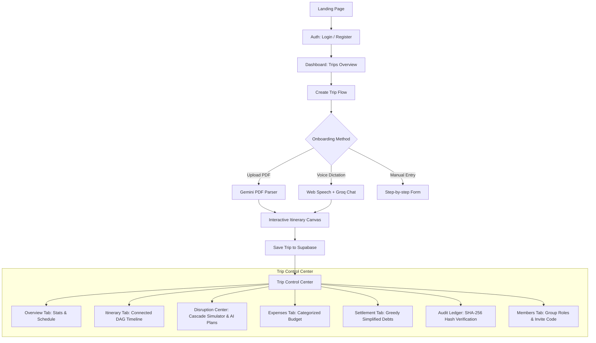

# TripTogether ✈️
### Intelligent Travel Resilience Engine & Group Disruption Recovery Platform

TripTogether transforms chaotic travel disruptions into instant, mathematically optimal recovery plans. Built for modern travelers navigating interconnected flights, trains, hotels, and tours, it models your entire trip as a **Directed Acyclic Graph (DAG)** to detect downstream cascade failures the moment a delay occurs.

---

## 🌟 Key Highlights & Standout Innovations

- **Topological Cascade Detector**: Automatically calculates downstream ripple effects when an upstream booking is delayed or cancelled (e.g. flight delay causing missed airport express causing hotel no-show).
- **Multi-Model AI Recovery Engine (Groq + Gemini)**: Instantly generates 3 distinct recovery plans (*Plan A: Cost Minimizer*, *Plan B: Time Disruption Minimizer*, *Plan C: Maximum Convenience*).
- **AI Itinerary Studio (PDF + Voice Dictation)**:
  - **Upload Booking PDF**: Extracts flight numbers, check-in times, vendors, and policies using Google Gemini.
  - **Voice & Chat Dictation**: Speak or describe your trip in natural speech via the Web Speech API. The AI identifies missing elements (e.g., missing hotel between flights) and asks clarifying questions in real-time.
  - **Interactive Itinerary Canvas**: Live visual timeline where travelers inspect buffer times and approve bookings before saving.
- **Greedy Debt Simplification**: Minimizes transaction volume among travel group members from $O(N^2)$ to at most $N-1$ transactions.
- **Cryptographic Audit Ledger**: Every booking change, disruption resolution, and settlement is hashed using a **SHA-256 hash chain**, creating an immutable, tamper-evident audit trail.
- **Light Theme Minimalist Aesthetic**: Crafted with warm amber accents (`#B45309`), ivory backgrounds (`#FAF9F7`), and zero distracting neon/purple AI clichés.

---

## 🛠️ Technology Stack

| Layer | Technology | Purpose |
|---|---|---|
| **Framework** | Next.js 14 (App Router) | Full-stack React framework with SSR and Server Actions |
| **Styling** | Vanilla CSS Modules | Clean design tokens, zero Tailwind bloat, light theme |
| **Relational Database** | Supabase (PostgreSQL) | Core relational storage with Row Level Security (RLS) |
| **Realtime Engine** | Firebase Firestore | Live sync for multi-user collaboration |
| **Fast AI Reasoning** | Groq (`llama-3.1-8b-instant`) | Sub-second recovery plan generation and conversational chat |
| **Smart Multimodal AI**| Google Gemini 1.5 Flash | Document/PDF parsing and resilience risk scoring |
| **Voice Dictation** | Web Speech API | Native speech-to-text with speech synthesis response |
| **Document Parsing** | `pdf-parse` | Server-side text buffer extraction from tickets |
| **Animations** | Framer Motion | Smooth staggered animations for cascade graphs |
| **Charts** | Recharts | Expense breakdowns and budget tracking |
| **Deployment** | Vercel | Seamless serverless edge deployment |

---

## 🚀 Quick Start Guide

### 1. Prerequisites
- Node.js 18+ installed on your system.
- A free [Supabase](https://supabase.com) account.
- Free API keys from [Groq Console](https://console.groq.com) and [Google AI Studio](https://aistudio.google.com).

### 2. Installation
```bash
# Clone the repository
git clone https://github.com/your-username/triptogether.git
cd triptogether

# Install dependencies
npm install
```

### 3. Environment Configuration
Copy the example environment template to create your `.env.local` file:
```bash
cp .env.local.example .env.local
```

Fill in the credentials in `.env.local`:
```env
# Supabase (PostgreSQL + Auth)
NEXT_PUBLIC_SUPABASE_URL=https://your-project.supabase.co
NEXT_PUBLIC_SUPABASE_ANON_KEY=your_supabase_anon_key
SUPABASE_SERVICE_ROLE_KEY=your_supabase_service_role_key

# Firebase (Realtime Firestore)
NEXT_PUBLIC_FIREBASE_API_KEY=your_firebase_api_key
NEXT_PUBLIC_FIREBASE_AUTH_DOMAIN=your_project.firebaseapp.com
NEXT_PUBLIC_FIREBASE_PROJECT_ID=your_firebase_project_id

# AI Providers
GROQ_API_KEY=gsk_your_groq_api_key
GEMINI_API_KEY=AIzaSy_your_gemini_api_key
```
*(Note: The application includes intelligent mock fallbacks for all AI and database services, allowing end-to-end evaluation even before configuring all keys!)*

### 4. Database Setup (Supabase)
1. Open your Supabase Dashboard and go to the **SQL Editor**.
2. Open [`supabase/schema.sql`](file:///supabase/schema.sql) from this repository, paste its contents into the editor, and click **Run**.
3. (Optional) Run [`supabase/seed.sql`](file:///supabase/seed.sql) to populate a fully connected demo trip ("Tokyo Cherry Blossom Expedition" with 4 interconnected bookings and sample disruptions).

### 5. Run the Local Development Server
```bash
npm run dev
```
Open [http://localhost:3000](http://localhost:3000) in your browser to experience TripTogether.

---

## 🧭 Application Architecture & User Flow



---

## ❓ How Does TripTogether Give Options When Disruption Happens in a Plan?

When an unexpected flight delay, cancelled train, or schedule change occurs, TripTogether uses a **two-stage hybrid intelligence system** combining **deterministic graph theory (DAG)** with **ultra-fast AI reasoning (Groq)**:

```
                       [ 1. Disruption Occurs ]
                    (e.g., Flight delayed 180 min)
                                   │
                                   ▼
             [ 2. Stage 1: Mathematical DAG Cascade Detector ]
                • Graph traversal: Upstream ➔ Downstream
                • Subtracts connection buffers: (Delay - Buffer)
                • Pinpoints exact casualties:
                  ❌ Missed Airport Train (delay > buffer)
                  ⚠️ Late Hotel Check-in
                  ❌ Missed Guided Tour
                                   │
                                   ▼
              [ 3. Stage 2: Multi-Model AI Recovery Engine ]
                     (Groq AI / qwen3.8-27b in ~1.2s)
                                   │
         ┌─────────────────────────┼─────────────────────────┐
         ▼                         ▼                         ▼
   [ Plan A: Cost-Saver ]   [ Plan B: Balanced ]   [ Plan C: Max Comfort ]
   • Claims refunds         • Re-schedules times    • Express replacement
   • Zero extra expense     • Preserves itinerary   • Recovers lost hours
   • +$0 / High refund      • Minimal schedule lag  • Premium convenience
```

### Stage 1: Deterministic DAG Cascade Traversal (`src/lib/algorithms/cascadeDetector.js`)
1. **Trip as a Graph**: Every itinerary is structured as a **Directed Acyclic Graph (DAG)** where each booking is a node, and connection requirements (e.g. Flight ➔ 90m buffer ➔ Train) are directed edges.
2. **Topological Ripple Analysis**: The moment a disruption delay is entered, the engine runs a breadth-first traversal propagating the delay downstream:
   $$\text{Downstream Delay} = \max(0, \text{Upstream Delay} - \text{Buffer})$$
3. **Casualty Classification**: Downstream bookings with non-zero delays are automatically graded by severity:
   - **Tight Connection** (< 60m margin remaining)
   - **At Risk** (60–120m delay impact)
   - **Missed Connection / Cascade Failure** (> 120m delay impact)

### Stage 2: Multi-Objective AI Plan Generation (`src/app/api/ai/recovery/route.js`)
Instead of generic travel advice, TripTogether feeds the exact graph output (root disruption + downstream casualties + remaining budget + full trip itinerary) to **Groq AI (`qwen/qwen3.8-27b`)** using structured JSON schemas to produce **3 Pareto-optimal recovery alternatives** in under 1.5 seconds:

| Plan | Objective | Strategy & Trade-off |
|---|---|---|
| **Plan A: Cost-Saver** | Minimize out-of-pocket expense | Claims refunds on disrupted legs, absorbs delay into non-essential free time, adjusts times with $0 cost delta. |
| **Plan B: Balanced** | Minimize schedule disruption | Shifts downstream booking windows, rebooks next available connection slots, keeps the whole group itinerary intact. |
| **Plan C: Maximum Convenience** | Maximize comfort & recovery speed | Upgrades to express transit (e.g., high-speed rail, express cab, VIP fast-track) to erase accumulated delay and preserve hotel check-ins. |

### What Happens When You Click "Apply Plan"?
1. **Instant Itinerary Synchronization**: The Supabase database automatically shifts the affected bookings to their new ISO timestamps and titles.
2. **Disruption Resolved**: The disruption state transitions from `Active Disruption` to `Resolved`.
3. **Cryptographic Audit Record**: A new block is hashed and appended to the **SHA-256 Ledger**, creating an immutable, tamper-evident record of the disruption resolution.

---

## 🧪 Verifying & Testing Features

1. **Test Cascade Disruption Simulation**:
   - Go to any trip's **Disruption Center** (`/trip/[id]/disruption`).
   - Select an upstream flight (e.g. Flight AI-306) and set a delay of 180 minutes.
   - Click **Run Simulation**. Watch the topological cascade engine calculate affected downstream bookings with animated dependency chains.
   - Click **Generate AI Recovery Plans** to see the 3 comparative recovery alternatives generated in real-time.
2. **Test AI Itinerary Studio**:
   - Navigate to `/trip/create` or open the **Itinerary** tab of a trip and click **AI Import & Dictate**.
   - Test PDF extraction: Click **"Try Sample Itinerary PDF"** or upload an airline confirmation.
   - Test Voice dictation: Click the microphone icon and speak your plans.
   - Review the bookings on the **Itinerary Canvas** and click **Approve & Confirm**.
3. **Test Ledger Hash Chain Integrity**:
   - Go to `/trip/[id]/settlement`.
   - Scroll to the **Immutable Ledger Audit Trail** section.
   - Click **Verify Chain Integrity** to cryptographically validate the SHA-256 chain links across all historical entries.

---

## 🚢 Deployment (Vercel)

This project is configured for one-click deployment on [Vercel](https://vercel.com):
1. Push your code to a GitHub repository.
2. Import the project in Vercel.
3. In the project settings, add the environment variables listed in `.env.local.example`.
4. Click **Deploy**.

---

## 📄 License
MIT License. Created for the Travel Disruption Resilience Hackathon.
